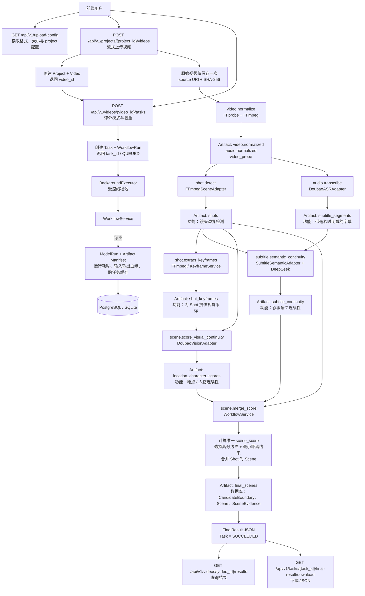

# Movie Analysis Platform

影片自动分段后端。上传视频后，FastAPI 在受控的进程内 Executor 中运行 Workflow，调用 FFmpeg 与模型 Adapter，生成可追踪的 Artifact、数据库记录和最终 Scene 分析结果。

## 当前能力

- 流式上传 MP4、MOV、AVI、MKV；后端用 FFprobe 校验真实容器并保存 SHA-256。
- FFmpeg 标准化生成视频、16 kHz 音频和媒体元数据；FFmpeg scene filter 生成 Shot。
- 为 Shot 抽取关键帧；豆包 Vision 生成地点和人物连续性；豆包 ASR 生成字幕；DeepSeek 生成字幕语义连续性。
- 按 `location_only`、`character_only`、`subtitle_only` 或 `custom` 计算唯一的 `scene_score`，选择边界并合并连续 Shot 为 Scene。
- 保存 `Video`、`Task`、`WorkflowRun`、`ModelRun`、`Artifact`、`Shot`、`Scene`、`SceneEvidence` 与最终 JSON；成功 Artifact 支持跨任务缓存复用。

## 架构

```text
Web client
  -> FastAPI routes -> TaskService -> BackgroundExecutor (bounded thread pool)
  -> WorkflowService -> FFmpeg / model adapters
  -> PostgreSQL or SQLite + local Artifact storage

Workflow:
upload -> normalize -> shots -> keyframes
       -> ASR -> subtitle semantics
       -> Vision -> merge/score -> FinalResult
```

## 完整分析流程



模型职责：FFmpeg Scene 负责 Shot 检测；豆包 ASR 负责字幕；DeepSeek 字幕语义 Adapter 负责叙事连续性；豆包 Vision 负责地点与人物连续性。最终边界选择、Scene 合并和 `scene_score` 仅由 WorkflowService 完成，而不是由任一模型直接决定。

当前不使用 Celery、Redis 或独立 Worker。API 重启时会将遗留的 PENDING、QUEUED、RUNNING 任务标为 `INTERRUPTED`；用户可用 retry API 创建新的不可变重试任务。

## 启动

```powershell
Copy-Item .env.example .env
python -m pip install -r requirements/api.txt
alembic upgrade head
python -m uvicorn apps.api.main:app --reload --host 0.0.0.0 --port 8080
```

需要 FFmpeg、可访问的数据库，以及在启用相应步骤时配置豆包 ASR、豆包 Vision、DeepSeek 和 Provider/ngrok。 `GET /health/ready` 会报告数据库、存储、FFmpeg、Provider Gateway、公共 URL 和模型凭据健康状态。

### 局域网访问

`.env` 中的 `API_HOST=0.0.0.0` 会让原生 FastAPI 监听本机全部网络接口。若 API 已在运行，先执行 `python scripts/dev/stop.py`，再运行 `python scripts/dev/start.py`；终端会打印形如 `http://192.168.x.x:8080` 的 LAN 地址。同一局域网设备可通过该地址访问网页和 API。前端使用相对 `/api/v1/...` 路径，因此无需另行设置 API 地址。

Windows 首次提示时应只允许 Python/Uvicorn 使用**专用网络**；不要在公用网络开放端口。Docker 的 PostgreSQL 和 Provider Gateway 仍保持仅本机可访问。

## API

| Method | Path | Purpose |
|---|---|---|
| GET | `/api/v1/upload-config` | 上传格式、大小和默认 project 配置 |
| POST | `/api/v1/projects/{project_id}/videos` | 流式上传视频，返回 `video_id` |
| POST | `/api/v1/videos/{video_id}/tasks` | 创建分析任务，返回 `task_id` |
| GET | `/api/v1/tasks/{task_id}` | 查询状态、阶段、进度与错误 |
| POST | `/api/v1/tasks/{task_id}/retry` | 创建重试任务 |
| GET | `/api/v1/videos/{video_id}/results` | 查询指定或最新成功任务的结果 |
| GET | `/api/v1/tasks/{task_id}/artifacts` | 列出该任务产物 |
| GET | `/api/v1/tasks/{task_id}/final-result/download` | 下载 FinalResult JSON |

创建任务的请求体支持 `scene_analysis`、`score_mode`、`cut_intensity`、`min_distance_s` 和三个 0–10 的权重；`custom` 权重会按总和归一化且不能全为零。 `force_recompute` 可选择跳过某些缓存步骤。

## 开发检查

```powershell
ruff check .
ruff format --check .
mypy .
pytest tests/unit -q
```

长期规则见 [AGENTS.md](AGENTS.md)，模型输入输出约束见 [IO_Rule.md](IO_Rule.md)，完整系统说明见 [多模态电影场景智能分段系统技术方案.md](多模态电影场景智能分段系统技术方案.md)。
